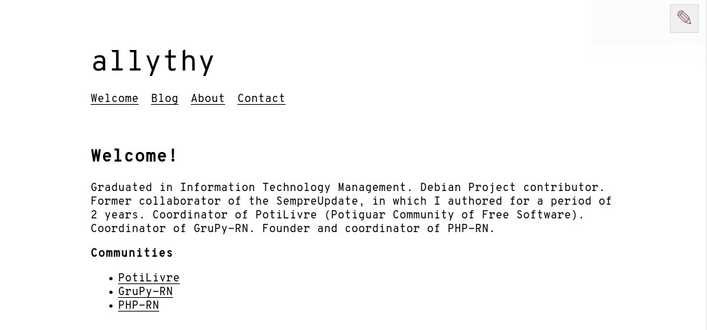

# Allythy - [Lektor](https://www.getlektor.com/)

This is a basic demo website that shows how to use Lektor for a basic website
with some pages and a blog.



**Install**

Install the dependencies and enter the virtual environment

```
pipenv install
pipenv shell
```

**Run**

Running the lektor

```
lektor server
```
